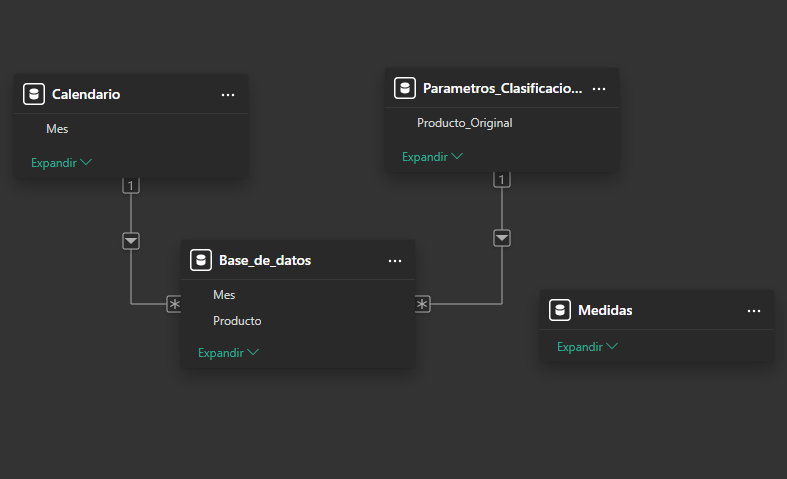

# 🌐 Website Performance Dashboard – Power BI Project

> ⚠️ **Confidentiality Disclaimer**  
> This project was created for **portfolio purposes only**.  
> - All data has been **anonymized or synthetically generated**.  
> - KPIs are representative, but do not reflect real or sensitive information.  
> - Field, table, and entity names were modified to protect company privacy.  
> The goal is to showcase technical and analytical capabilities applied to BI dashboard development.

> 📌 **Note:** The project and dataset are in **Spanish**, as it was originally designed for a Spanish-speaking client.

---

## 📁 Repository Structure

📁 dataset/ → Monthly CSVs (anonymized web analytics exports)

📁 pbix/ → Power BI project file (.pbix)

📁 video/ → Short interactive demo (navigation & slicers)

📁 images/ → Dashboard screenshots for this README

📁 theme/ → Custom Power BI color palette (.json)


---

## 🎯 Project Overview

The marketing team requested a dashboard to **analyze website performance**, focusing on the relationship between **product catalog downloads and page views**.

The goal was to build a **scalable, easy-to-use, automated monthly report** to help identify high-performing products and categories based on user engagement.

---

## 📂 Data Sources & Preparation

- **Data origin:** `.csv` files exported from Google Analytics (1 file per month).
- **Semi-automated flow:** each month, a new CSV is added to the folder and Power BI updates automatically.
- **Challenges:**
  - Google Analytics captures **all events and interactions**. It required significant **data cleaning in Power Query** to isolate meaningful views and downloads.
  - A **product classification dimension table** was built to enable grouped analysis by category.

---

## 🧩 Data Model

A simple but optimized star schema designed for performance and clarity:

- **Fact table:** product views and downloads by date.
- **Dimension tables:** 
  - Product categories.
  - Calendar table (for time intelligence).
- **KPI/Measures table:** separated for a clean, scalable model.



---

## 🎨 Dashboard Design


[▶ Watch short demo (MP4)](video/demo.mp4)

Design and user experience were a top priority in this dashboard:

- **Custom color palette**:
  - Built using a `.json` file.
  - **Dark blue background** with **yellow/orange highlights** for KPIs and comparisons.
  - Included in `theme/color_palette.json`. 

- **Website-like navigation menu:**
   - Navigation between the overview and category pages.
   - Implemented using shapes, bookmarks, and color-coded tabs.
- **Custom iconography:**
  - PNG icons edited in Photopea to match the theme.
  - Based on Flaticon resources.

The result is a user-friendly, visually appealing BI experience, even for non-technical audiences.

---

## 📊 Highlighted Visuals

🔹 KPI cards for visits, downloads, and conversion rate.
🔹 Stylized comparison tables by product and category.
🔹 Dual-axis line charts to compare trends between visits and downloads.

---

## 🔢 Key Measures (DAX)

### Download Rate:

```DAX
% Descargas = 
DIVIDE(
    [Descargas],
    [Visitas],
    0
)

Calculates the conversion rate of views into downloads.

### Top Product by Downloads:

```DAX
Producto Top Descargas =
VAR ProductoTop =
    TOPN(
        1,
        VALUES('Base_de_datos'[Producto Anonimo]),
        [Descargas],
        DESC
    )
RETURN
    ProductoTop

Returns the product with the most downloads, dynamically filtered by time/category.

---

## 💡 Value & Impact

- **⏱️ Time savings:** the monthly update process became nearly automatic.
- **🔍 Improved visibility:** marketing gained clear insights into high-interest products and user behavior.
- **🎨 Professional look & feel:** the dashboard’s visual design encouraged higher engagement from non-technical users.

---

## 🧠 Technical Learnings & Challenges

- **Advanced cleaning in Power Query:** filtering noisy Google Analytics exports.
- **Design-thinking in BI:** creating custom color palettes, styling icons, and drawing inspiration from modern websites.
- **User-centered UX:** making navigation intuitive and storytelling clear.

---

## 👤 About Me

**Joaquín Ferrer**
Industrial Engineer · Data Analyst · Power BI · SQL


🔗 [LinkedIn](https://www.linkedin.com/in/joaqu%C3%ADnferrer/) 
📘 [Notion Portfolio](https://sun-sofa-ba8.notion.site/Joaqu-n-Ferrer-Portafolio-Profesional-2163e852260a808f9377e971506e0f1f?source=copy_link) 
💻 [GitHub](https://github.com/joacoferrer00)

---

## ⚖️ License

This repository is shared for educational and professional showcase purposes.
You may explore, fork, or reuse with attribution.
→ License: MIT

---


